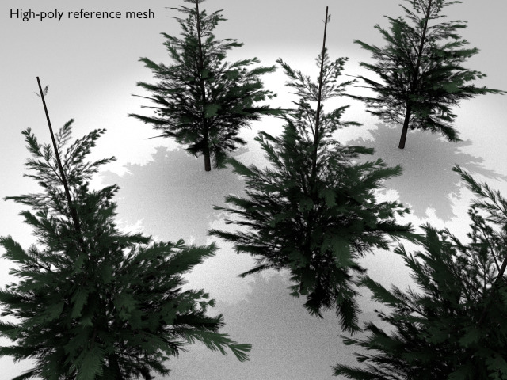
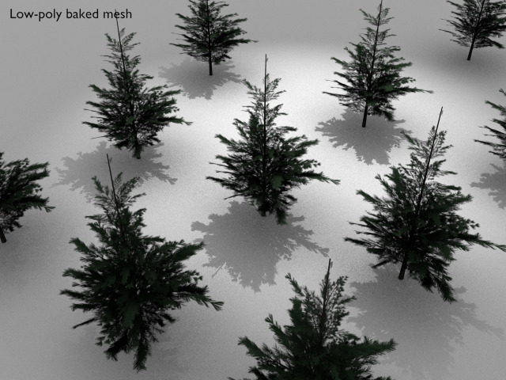
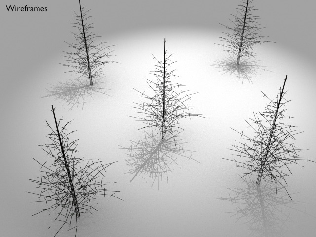

Pine
===






License
===

```
© 2017 Mark Raynsford <visual@io7m.com>

This work is licensed under a Creative Commons Attribution 4.0
International License.

You should have received a copy of the license along with this
work. If not, see <http://creativecommons.org/licenses/by/4.0/>.

```

Scene statistics
===

```
Mesh: tree_high.000
  Polygons: 1637
  Textures:
    Image: pine_512_1024.png 512x1024

Mesh: tree_low.000
  Polygons: 1637
  Textures:
    Image: pine_512_1024.png 512x1024

```

